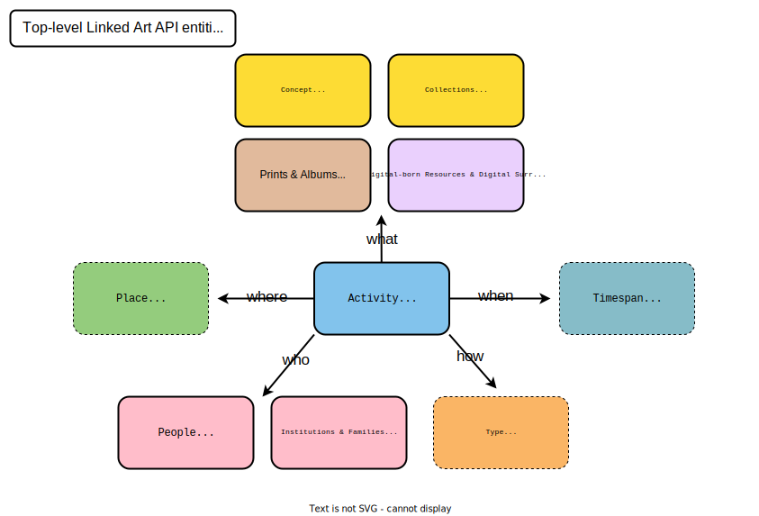

# PIA Linked Art
[Linked Art](https://linked.art) Modelling for the for the Participatory Knowledge Practices in Analogue and Digital Image Archives (PIA) research project, based on three photographc collections from the Swiss Society for Folkflore Studies (SSFS / _Schweizerische Gesellschaft für Volkskunde, SGV_). 

Linked Art is an application profile for [CIDOC-CRM](https://cidoc-crm.org/) in JSON-LD. 

## Boilerplates

Below are the boilerplates that are needed within the PIA Data Model in accordance with the [Linked Art API Entity Endpoints](https://linked.art/api/1.0/endpoint/).

### Main entities

| **Linked Art API Endpoints**                                                                                                   | **/path/**     | **SGV Data Model (Class)**      | **Relevance to PIA**                                                                                                                                                                                                                                                                                                                            |
|--------------------------------------------------------------------------------------------------------------------------------|----------------|---------------------------------|-------------------------------------------------------------------------------------------------------------------------------------------------------------------------------------------------------------------------------------------------------------------------------------------------------------------------------------------------|
| **Concept** - Types, Materials, Languages, and others, as full records rather than external references (_not yet visible on the Linked Art website_)                                                               | `/concept/`    | `sgv:Concept`                    | The terms from the [Ernst Brunner Thesaurus](https://vocab.participatory-archives.ch/), currently done in SKOS could be modelled in Linked Art. |
| **Digital Objects** - Images, services and other digital objects                                                               | `/digital/`    | `sgv:Object`                    | It will be leveraged for digital-born resources as well as digital (positive) surrogates that were created from negatives. For the latter, the negatives are still being integrated within the model as a `HumanMadeObject` through the `P94i_was_created_by` property - cf. [PIA ID 12033 - [Schwyzer Fasnacht]](modelling/digital/12033.json) |
| **Events** - Events and other non-specific activities that are related but not part of other entities                          | `/event/`      | `sgv:Event`                     | A very interesting entity to be used, we need to pinpoint what kind of events are relevant to us as `sgv:Event` is a new class in the SGV Data Model.                                                                                                                                                                                           |
| **Groups** - Groups and Organizations                                                                                          | `/group/`      | `sgv:Agent`                     | Within the SGV Data Model, it is a mix of Groups, Organizations and People at the moment. Data reconciliation needs to be undertaken.                                                                                                                                                                                                           |
| **People** - People                                                                                                            | `/person/`     | `sgv:Agent`                     | Within the SGV Data Model, it is a mix of Groups, Organizations and People at the moment. Data reconciliation needs to be undertaken.                                                                                                                                                                                                           |
| **Physical Objects** - Physical things, including artworks, buildings or other architecture, books, parts of objects, and more | `/object/`     | `sgv:Object`                    | It will be leveraged for all print photographs and albums ("everything that can easily be held in one's hands") - cf. [PIA ID 60 - [Porträt von Emilie Kreis-Martz]](modelling/object/60.json).                                                                                                                                                                                                                                |
| **Places** - Geographic places                                                                                                 | `/place/`      | None                            | Even though the SGV Data Model doesn't have a proper class handling geographic data, this could be leveraged through internal (mainly for the SGV_05 Atlas of Swiss Folklore) and external (Geonames) mappings, or doing some data reconciliation and pointing to Getty's [Thesaurus of Geographic Names Online](https://www.getty.edu/research/tools/vocabularies/tgn/index.html) (TGN) instead.                                                                                                                                  |
| **Provenance Activities** - The various events that take place during the history of a physical thing                          | `/provenance/` | `sgv:Event`                     | A very interesting entity to be used, we need to pinpoint what kind of events are relevant to us as `sgv:Event` is a new class in the SGV Data Model and we may not have well-structured metadata for those kind of activities.                                                                                                                 |
| **Sets** - Sets, including Collections and sets of objects used for exhibitions                                                | `/set/`        | `sgv:Collection`, `sgv:Dataset` | It will be leveraged for the official Archives' collections and perhaps it could also be used for user-generated collections and datasets. - - cf. [SGV_12 (Ernst Brunner)](modelling/set/12.json).                                                                                                                                                                                                     |
| **Text** - Texts worthy of description as distinct entities, such as the content carried by a book or journal article | `/text/`       | None                            | It could be used for the Atlas of Swiss Folklore (SGV_05) as well as for journals referencing photos taken by Ernst Brunner (SGV_12). For the latter, we don't have the data and metadata so it could be quite complex to retrieve those pieces of (meta)information.                                                                           |
| **Visual** - Image content worthy of description as distinct entities, such as the image shown by a painting or drawing  | `/visual/`     | None                            | It isn't planned to be leveraged as `VisualItem` are embedded within `DigitalObject` serialisations                                                                                                                                                                                                                                             |

*NB: The content found in [01_Object](modelling/01_Object/) are the first data modelling attempts in Linked Art and are kept for documentation purposes.* 

Below is an high-level overview of the PIA Linked Art Model

## Mappings

[Mappings](mapping/README.md) between the old SSFS Data Model (hosted on Salsah), the upcoming SSFS Data Model (hosted on DaSCH Service Platform), Schema.org, the PIA JSON API and Linked Art are being documented in this GitHub Repository as well. 

## Data reconciliation

### Alignement with the AAT 

A reconciliation effort between controlled terms from the SSFS and the Getty's [Art & Architecture Thesaurus](https://www.getty.edu/research/tools/vocabularies/aat/) (AAT), especially with respect to materiality concepts, is being undertaken. 

For the moment, two (incomplete) CSV are available: 

- [Photo techniques](reconciliation/aat/technology_hasModel.csv)
- [Object types](reconciliation/aat/objecttype_hasObjecttype.csv)

### Reconciliation of Agent-related records (organisations, groups, people)  

TBD

