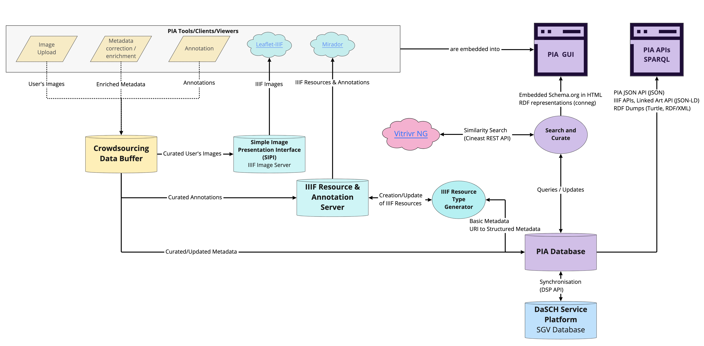

# Metadata Mapping

Mappings were done in the context of the database migration of the photographic archives of the Swiss Society for Folkflore Studies (SSFS / _Schweizerische Gesellschaft für Volkskunde, SGV_) and for the [PIA research project](https://about.participatory-archives.ch), where different APIs (including IIIF and Linked Art) will be leveraged (see the simplified overview of the PIA Architecture below)

## Models

- Old SSFS/SGV Data Model hosted on [Salsah](https://www.salsah.org/)
- New SSFS/SGV Data Model, which has for most of its properties external mapping to [Schema.org](https://schema.org/). It will be hosed on the [DaSCH Service Platform](https://docs.dasch.swiss/) (DSP)
- [PIA JSON API](https://data.participatory-archives.ch/) 
- [Linked Art](https://linked.art/)

The metadata mapping (work in progress) is [available as CSV](mapping.csv). 

## Limitations

- The PIA JSON API which is based on a [database dump](https://github.com/Participatory-Image-Archives/pia-data-model/tree/main/dbml) - reworked from a [(meta)data export from Salsah that was done mid-2021](https://github.com/Participatory-Image-Archives/pia-data-model/tree/main/salsah-export) - and which has and continues to evolve to accomodate the research project needs. After the migration of the database, this will also be amended in terms of properties and the metadata will be updated. For example, names of the endpoints (such as _images_ to _objects_) will be modified and others still need to be properly deployed (like all metadata related to object types, formats and model types/photo techniques)
- The synchronisation process with the DSP API, is still something that is to be investigated after the database migration.